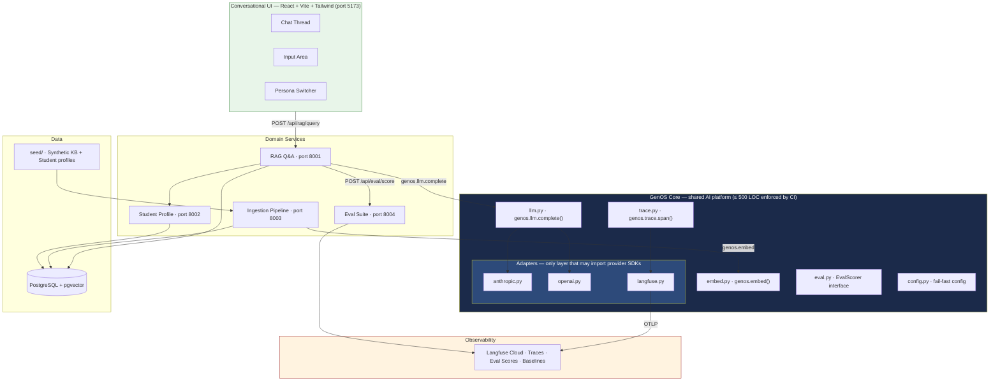
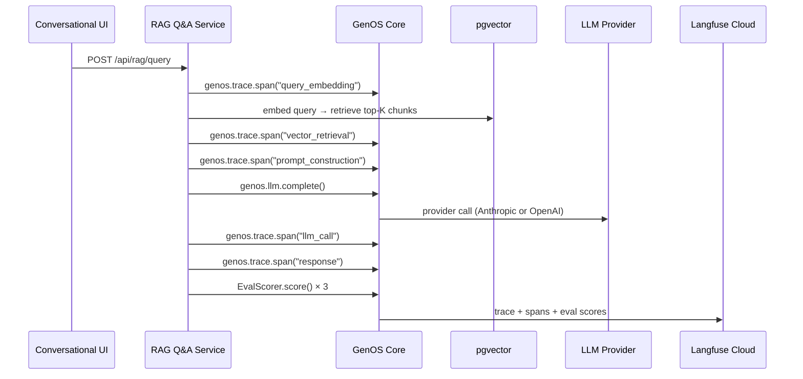

# AI Playground

> An enterprise-grade AI engineering sandbox — built to explore, compare, and evaluate AI capabilities the right way.

Most AI demos are throwaway. They work once, can't be compared to anything, and teach you nothing about how the capability behaves at scale. This repo is the opposite.

**AI Playground** is a structured experimentation platform built around **GenOS** — a shared AI Operating System that enforces observability, LLM abstraction, and eval scoring on every interaction. Every experiment is traced. Every response is scored. Every run is comparable.

The domain is a university assistant. That's just the vehicle — realistic enough to produce meaningful data shapes and personas, not so complex it gets in the way of the AI engineering.

---

## What You Can Explore

| Capability | What's built |
|------------|-------------|
| **RAG** | Retrieval-Augmented Generation with configurable TOP_K, chunk size, similarity threshold, and embedding model |
| **Evals** | LLM-as-judge scoring on every response — `retrieval_relevance`, `answer_faithfulness`, `answer_relevance` |
| **Observability** | Full OpenTelemetry tracing → Langfuse Cloud. 5 child spans per query, zero untraced LLM calls |
| **LLM abstraction** | `genos.llm.complete()` — swap Anthropic ↔ OpenAI via a single env var, no code changes |
| **Baseline comparison** | Tag any run as baseline, diff eval scores across experiments programmatically |
| **Prompt versioning** | Prompt templates are files, not strings. Every trace records which version was used |
| **Ingestion pipeline** | Chunking, embedding, and vector storage with full trace coverage and pluggable adapters |

---

## GenOS — The Platform Core

GenOS is the AI Operating System that all experiments run on. It is deliberately small (≤ 500 LOC, enforced by CI) and sits between your experiment code and every provider SDK.

```
genos/
  llm.py       # genos.llm.complete() — the only way to call an LLM
  embed.py     # genos.embed() — the only way to call an embedding model
  trace.py     # genos.trace.span() — OpenTelemetry wrapper
  eval.py      # EvalScorer interface — plug in any scorer
  config.py    # fail-fast config — missing key = named error in 2s
  adapters/
    anthropic.py   # only file that may import anthropic SDK
    openai.py      # only file that may import openai SDK
    langfuse.py    # only file that may import langfuse SDK
```

**The rules (enforced by CI, not convention):**

- No Domain Service may import `anthropic`, `openai`, or `langfuse` directly — CI grep fails the build
- Every LLM call, retrieval step, and eval event must emit a GenOS Trace — zero blind spots
- GenOS core must not exceed 500 LOC — complexity belongs in Adapters
- Swap providers, observability backends, or eval scorers without touching experiment code

---

## Architecture



---

## Tech Stack

| Layer | Choice |
|-------|--------|
| Backend | Python · FastAPI · uv workspaces (monorepo) |
| Frontend | React · Vite · TypeScript · Tailwind CSS · shadcn/ui |
| Vector store | PostgreSQL + pgvector |
| LLM providers | Anthropic · OpenAI (config-driven via GenOS) |
| Tracing | OpenTelemetry → Langfuse Cloud |
| Orchestration | LangChain (text splitting + prompt templates only) |
| Migrations | Alembic (per-service) |
| CI | GitHub Actions — LOC gate · import lint gate |
| Local dev | Docker Compose — one command, everything running |

---

## How an Experiment Run Works

Every query through the system produces a single **Experiment Run** — a Langfuse trace with 5 child spans and 3 eval scores attached.



**What lands in Langfuse per run:**
- Provider, model, prompt tokens, completion tokens, latency, estimated cost
- Chunk IDs used as context
- Prompt template version
- `retrieval_relevance` · `answer_faithfulness` · `answer_relevance` scores [0.0–1.0]
- Baseline delta (if a baseline run is tagged)

---

## Key Design Decisions

| Concern | Decision | Why |
|---------|----------|-----|
| LLM access | `genos.llm.complete()` only | Switch providers via env var, zero code change |
| Tracing | OpenTelemetry → Langfuse — no `langfuse` in Domain Services | Swap observability backends without touching experiment code |
| Eval metrics | 3 scores per run, every run | Baselines are only meaningful if every run is scored the same way |
| GenOS LOC cap | CI fails if `genos/` exceeds 500 LOC | Forces simplicity — complexity goes in Adapters, not the core |
| Import safety | CI grep for banned imports in `services/` | Architecture enforced mechanically, not by trust |
| Config | Everything from env — provider, model, TOP_K, chunk size, prompts | Same code, different experiment parameters |

---

## Repo Structure

```
genos/                        # GenOS core — the AI platform (≤ 500 LOC)
services/
  rag_qa/                     # RAG Q&A service
  student_profile/            # Student profile + conversation history
  ingestion/                  # Chunking, embedding, vector storage
  eval/                       # Eval scoring suite
frontend/                     # React + Vite conversational UI
seed/                         # Synthetic Knowledge Base + student profiles
_bmad-output/
  planning-artifacts/
    product-brief.md          # Why this exists
    prds/                     # Requirements (30 FRs · 16 NFRs)
    architecture.md           # Full ADRs and monorepo setup
    epics.md                  # Epic + story breakdown
    ux-designs/               # Design system + interaction spec + mockups
  project-context.md          # LLM-optimized context for dev agents
```

> No application code exists yet — planning is complete, implementation starts at Story 1 (GenOS scaffold).

---

## Planning Status

| Artifact | Status |
|----------|--------|
| [Product Brief](_bmad-output/planning-artifacts/product-brief.md) | ✅ Complete |
| [PRD v2](_bmad-output/planning-artifacts/prds/prd-university-ai-v2-2026-06-04/prd.md) | ✅ Complete |
| [Architecture](_bmad-output/planning-artifacts/architecture.md) | ✅ Complete |
| [UX Design](_bmad-output/planning-artifacts/ux-designs/ux-university-ai-2026-06-04/DESIGN.md) | ✅ Complete |
| [UX Interaction Spec](_bmad-output/planning-artifacts/ux-designs/ux-university-ai-2026-06-04/EXPERIENCE.md) | ✅ Complete |
| [Epics & Requirements](_bmad-output/planning-artifacts/epics.md) | 🔄 In review |
| [Project Context](_bmad-output/project-context.md) | ✅ Complete |

---

## Roadmap

Each MVP adds a new AI capability track on top of the GenOS platform.

| MVP | Capability Track |
|-----|-----------------|
| **MVP 1** *(current)* | RAG · embeddings · evals · full observability |
| MVP 2 | Long-term memory · degree reasoning · proactive flags |
| MVP 3 | Agentic workflows · document intelligence · tool use |
| MVP 4 | Multi-agent orchestration · MCP integration |
| MVP 5 | Guardrails · prompt injection defense · adversarial evals |

---

## How this was Built

Planning was driven by the **[BMAD Method](https://bmad-method.org)** — specialized AI agents (PM, Architect, UX Designer, Engineer, Test Architect) working sequentially through discovery, requirements, design, and architecture before any code is written.

Before finalizing the epic structure, four agents independently reviewed and critiqued the plan — they disagreed with each other and caught real issues. The revised plan reflects those corrections.

If you have [Claude Code](https://claude.ai/code) installed:

```bash
/bmad-help           # see where you are in the workflow
/bmad-dev-story      # start implementing the next story
/bmad-sprint-status  # check current sprint state
```

---

*Built with the [BMAD Method](https://bmad-method.org) · June 2026*
