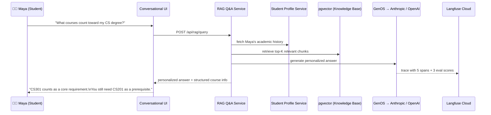
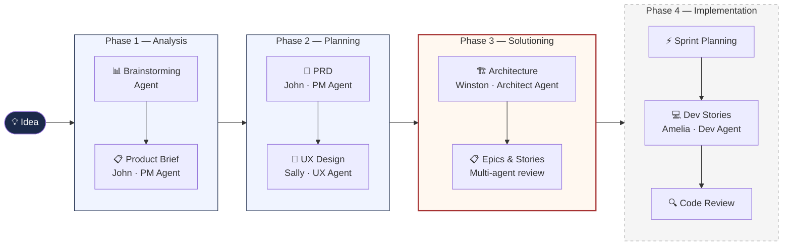
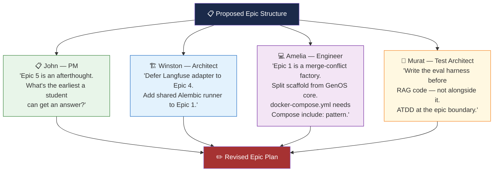
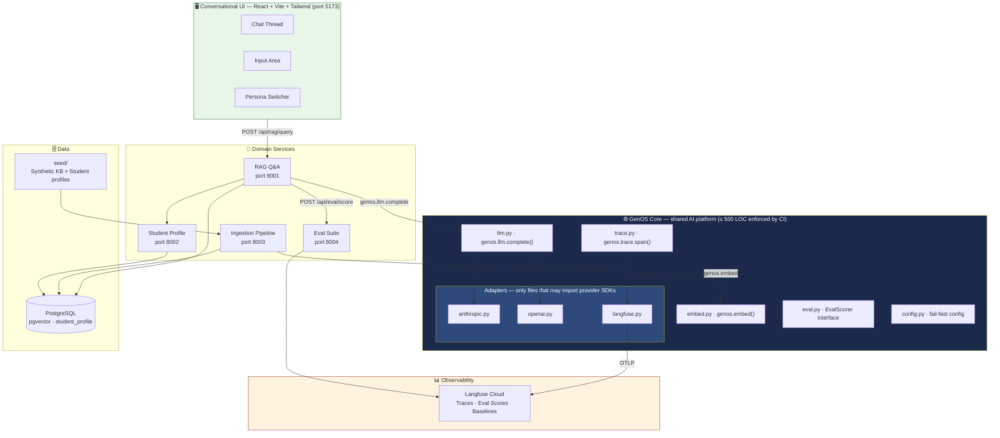
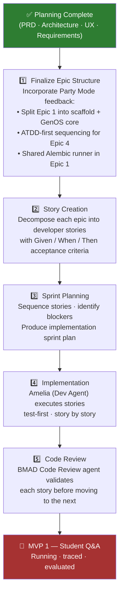

# University AI — Conversational University Assistant

> An AI-powered assistant for universities — built on a shared GenOS platform.  
> This repo demonstrates end-to-end AI product engineering using the **BMAD Method**.

---

## 1. The Problem Worth Solving

Universities are complex. The systems built to navigate them are not.

Five portals. Three support queues. One advisor who books out three weeks. A policy PDF last updated in 2019.

**University AI collapses all of that into a single conversation.**

Ask anything. Get a personalized, sourced answer in seconds — not a search result, not a ticket number.

| Who | What changes |
|-----|-------------|
| **Students** | One place for every question — courses, deadlines, policies, advising |
| **Advisors** | Walk into appointments already informed |
| **Admins** | Stop answering the same 50 questions by hand |
| **Faculty** | Never answer "what's on the syllabus?" at 11pm again |

Every answer runs through **GenOS** — a shared AI operating system that traces, evaluates, and logs every interaction. The university gets smarter. The engineering team gets a world-class AI lab.

**MVP 1:** A student asks a question. GenOS retrieves the right context, generates a grounded answer, and logs the full trace to Langfuse — observable end-to-end.



---

## 2. How is BMAD Used?

[BMAD (Build Me A Dream)](https://bmad-method.org) is an agentic AI development framework. Instead of one general-purpose AI, it orchestrates **specialized agents** — PM, Architect, UX Designer, Engineer, Test Architect — each driving their own phase with genuine domain expertise.

The workflow is structured and sequential. Each phase produces artifacts the next phase depends on. No blank-page paralysis. No requirements drift.



### Party Mode — Multi-Agent Review

Before finalizing the epic structure, four AI agents independently reviewed and critiqued the plan. They disagreed with each other. They caught real issues.



---

## 3. What is Completed?

All planning artifacts are done. The project is **implementation-ready**.

| Artifact | Status | Description |
|---|---|---|
| [Product Brief](_bmad-output/planning-artifacts/product-brief.md) | ✅ | The *why* — product vision, personas, constraints |
| [PRD v2](_bmad-output/planning-artifacts/prds/prd-university-ai-v2-2026-06-04/prd.md) | ✅ | 30 functional requirements across 9 components, 5-MVP roadmap |
| [Architecture](_bmad-output/planning-artifacts/architecture.md) | ✅ | Full stack decisions, directory structure, CI enforcement rules |
| [UX Design System](_bmad-output/planning-artifacts/ux-designs/ux-university-ai-2026-06-04/DESIGN.md) | ✅ | Design tokens, 8 components specified to pixel precision |
| [UX Interaction Spec](_bmad-output/planning-artifacts/ux-designs/ux-university-ai-2026-06-04/EXPERIENCE.md) | ✅ | State machine, focus management, WCAG 2.2 AA floor, microcopy |
| [Epics & Requirements](_bmad-output/planning-artifacts/epics.md) | 🔄 | 30 FRs + 16 NFRs + 17 UX-DRs extracted; epic structure in review |
| [Project Context](_bmad-output/project-context.md) | ✅ | LLM-optimized context file loaded by dev agents at implementation time |

### System Architecture



### Key Design Decisions

| Concern | Decision | Why |
|---|---|---|
| LLM access | `genos.llm.complete()` only — no direct SDK imports in services | Switch providers via config, zero code change |
| Observability | OpenTelemetry → Langfuse Cloud — no `langfuse` imports in services | Swap backends without touching domain code |
| Eval scores | 3 metrics per Q&A run: `retrieval_relevance`, `answer_faithfulness`, `answer_relevance` | Every run is comparable; baselines are meaningful |
| GenOS size | CI gate: fails build if `genos/` exceeds 500 LOC | Simplicity is a feature; complexity goes in Adapters |
| Import safety | CI gate: `grep` for banned imports in `services/` fails build | Architectural rules enforced mechanically, not by convention |
| Local dev | `docker compose up` — one command, everything running | Cold-start under 30 minutes from clone |

---

## 4. What are the Next Steps?



### MVP Roadmap Beyond MVP 1

| MVP | Theme | Key New Capability |
|---|---|---|
| **MVP 1** *(this repo)* | **Student Q&A** | RAG, embeddings, evals, observability |
| MVP 2 | Know Me | Long-term memory, degree reasoning, proactive flags |
| MVP 3 | Do Things For Me | Agentic workflows, document intelligence, real auth |
| MVP 4 | Everyone's Assistant | Multi-agent orchestration, MCP, all personas active |
| MVP 5 | Hardening | Guardrails, prompt injection defense, adversarial evals |

---

## Exploring This Repo

```bash
# Planning artifacts — start here
_bmad-output/planning-artifacts/

# The AI platform design
_bmad-output/planning-artifacts/architecture.md

# The product requirements
_bmad-output/planning-artifacts/prds/prd-university-ai-v2-2026-06-04/prd.md

# The UX design system
_bmad-output/planning-artifacts/ux-designs/ux-university-ai-2026-06-04/

# The BMAD workflow skills (how each phase was driven)
.claude/skills/
```

If you have [Claude Code](https://claude.ai/code) installed:

```bash
/bmad-help          # see where you are in the workflow
/bmad-dev-story     # start implementing the next story
/bmad-sprint-status # check current sprint state
```

---

*Built with the [BMAD Method](https://bmad-method.org) · June 2026*
