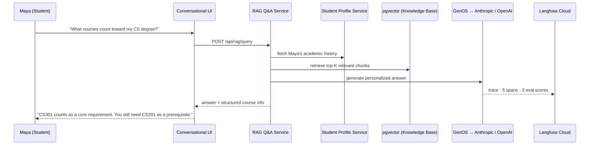
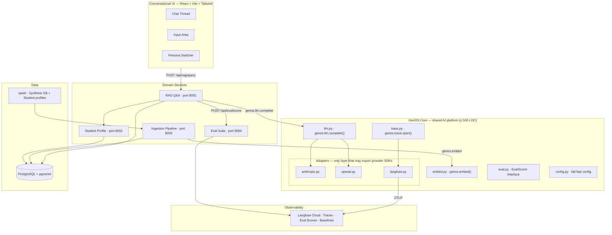
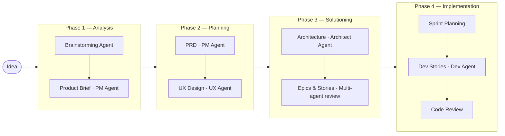

# University AI

> One conversation. Every university question answered.

A student shouldn't need five portals, three support queues, and a Thursday appointment to find out if a course counts toward their degree. **University AI** fixes that — a single conversational interface grounded in the university Knowledge Base, personalized to each student, and observable end-to-end.

Built on **GenOS** (Generative AI Operating System) — a shared platform that abstracts LLM providers, enforces tracing on every call, and runs eval scoring on every response. Every conversation is also an experiment.

**Current scope — MVP 1:** Student Q&A via RAG. Ask a question, get a personalized answer, every interaction traced and evaluated in Langfuse.

---

## How it Works



---

## Architecture



### Key Decisions

| Concern | Decision | Rationale |
|---------|----------|-----------|
| LLM access | `genos.llm.complete()` only — no direct SDK imports in Domain Services | Switch providers via config, zero code change |
| Tracing | OpenTelemetry → Langfuse Cloud — no `langfuse` imports in Domain Services | Swap backends without touching domain code |
| Eval metrics | 3 scores per run: `retrieval_relevance`, `answer_faithfulness`, `answer_relevance` | Every run is comparable; baselines are meaningful |
| GenOS size | CI gate fails if `genos/` exceeds 500 LOC | Simplicity is a feature; complexity belongs in Adapters |
| Import safety | CI gate greps for banned imports in `services/` | Architecture enforced mechanically, not by convention |
| Local dev | `docker compose up` — one command, everything running | Cold-start under 30 minutes from clone |

---

## Tech Stack

| Layer | Choice |
|-------|--------|
| Frontend | React · Vite · Tailwind CSS · shadcn/ui |
| Backend | Python · FastAPI |
| Vector store | PostgreSQL + pgvector |
| LLM providers | Anthropic · OpenAI (config-driven) |
| Observability | Langfuse Cloud (OTLP) |
| Orchestration | LangChain (text splitting + prompt templates only) |
| Auth | None in MVP 1 — Persona Switcher only |

---

## Personas

| Persona | MVP 1 | What changes |
|---------|-------|-------------|
| Student | Active | Instant answers grounded in the Knowledge Base, personalized to their academic profile |
| Admin | Coming soon | Handles repetitive applicant questions without manual triage |
| Advisor | Coming soon | Walks into appointments already informed |
| Faculty | Coming soon | Never answers "what's on the syllabus?" at 11pm again |

---

## Repo Structure

```
_bmad-output/
  planning-artifacts/
    product-brief.md          # Product vision, personas, constraints
    prds/                     # PRD v1 and v2 with decision logs
    architecture.md           # Full stack decisions and ADRs
    epics.md                  # 30 FRs · 16 NFRs · 17 UX requirements · epic breakdown
    ux-designs/               # Design system, interaction spec, HTML mockups
    implementation-readiness-report-2026-06-04.md
  project-context.md          # LLM-optimized context loaded by dev agents at implementation time
  brainstorming/              # Ideation session artifacts

_bmad/                        # BMAD framework config and agent skills
```

> No application code exists yet. The next step is Story 1: scaffold the GenOS monorepo.

---

## Planning Status

| Artifact | Status |
|----------|--------|
| [Product Brief](_bmad-output/planning-artifacts/product-brief.md) | ✅ Complete |
| [PRD v2](_bmad-output/planning-artifacts/prds/prd-university-ai-v2-2026-06-04/prd.md) | ✅ Complete |
| [Architecture](_bmad-output/planning-artifacts/architecture.md) | ✅ Complete |
| [UX Design](_bmad-output/planning-artifacts/ux-designs/ux-university-ai-2026-06-04/DESIGN.md) | ✅ Complete |
| [UX Interaction Spec](_bmad-output/planning-artifacts/ux-designs/ux-university-ai-2026-06-04/EXPERIENCE.md) | ✅ Complete |
| [Epics & Requirements](_bmad-output/planning-artifacts/epics.md) | 🔄 In review |
| [Project Context](_bmad-output/project-context.md) | ✅ Complete |

---

## Roadmap

| MVP | Theme | New Capability |
|-----|-------|----------------|
| **MVP 1** *(current)* | Student Q&A | RAG · embeddings · evals · observability |
| MVP 2 | Know Me | Long-term memory · degree reasoning · proactive flags |
| MVP 3 | Do Things For Me | Agentic workflows · document intelligence · real auth |
| MVP 4 | Everyone's Assistant | Multi-agent orchestration · MCP · all personas active |
| MVP 5 | Hardening | Guardrails · prompt injection defense · adversarial evals |

---

## How this was Built

This project uses the **[BMAD Method](https://bmad-method.org)** — an agentic AI development framework that orchestrates specialized agents (PM, Architect, UX Designer, Engineer, Test Architect) through a structured planning workflow before a single line of code is written.



Before finalizing the epic structure, four agents independently reviewed and critiqued the plan — PM, Architect, Engineer, and Test Architect. They disagreed with each other and caught real issues. The revised plan reflects those corrections.

If you have [Claude Code](https://claude.ai/code) installed:

```bash
/bmad-help           # see where you are in the workflow
/bmad-dev-story      # start implementing the next story
/bmad-sprint-status  # check current sprint state
```

---

*Built with the [BMAD Method](https://bmad-method.org) · June 2026*
